# FanavaranFarda_db documentation
## Summary

- [Introduction](#introduction)
- [Database Type](#database-type)
- [Table Structure](#table-structure)
	- [users](#users)
	- [student](#student)
	- [staff](#staff)
	- [course_categories](#course_categories)
	- [courses](#courses)
	- [classrooms](#classrooms)
	- [enrollments](#enrollments)
	- [attendances](#attendances)
	- [assignments](#assignments)
	- [student_assignment_uploads](#student_assignment_uploads)
	- [assignment_feedbacks](#assignment_feedbacks)
	- [session_grades](#session_grades)
	- [term_grades](#term_grades)
	- [tuitions](#tuitions)
	- [payrolls](#payrolls)
	- [expenses](#expenses)
	- [project_incomes](#project_incomes)
	- [project_expenses](#project_expenses)
	- [teacher_evaluations](#teacher_evaluations)
	- [feedbacks](#feedbacks)
	- [suggestions](#suggestions)
	- [poll_questions](#poll_questions)
	- [poll_responses](#poll_responses)
	- [competitions](#competitions)
	- [competition_registrations](#competition_registrations)
	- [competition_results](#competition_results)
	- [course_contents](#course_contents)
	- [course_topics](#course_topics)
	- [course_faqs](#course_faqs)
- [Relationships](#relationships)
- [Database Diagram](#database-diagram)

## Introduction

## Database type

- **Database system:** SQLite
## Table structure

### users
جدول کاربران و احراز هویت
| Name              | Type         | Settings                             | References | Note                |
| ----------------- | ------------ | ------------------------------------ | ---------- | ------------------- |
| **id**            | INTEGER      | 🔑 PK, not null, autoincrement       |            | شناسه یکتا          |
| **username**      | VARCHAR(10)  | not null, unique                     |            | کد ملی (نام کاربری) |
| **full_name**     | VARCHAR(120) | not null                             |            | نام و نام خانوادگی  |
| **role**          | VARCHAR(80)  | not null                             |            | نقش (هنرجو یا کادر) |
| **access_level**  | VARCHAR(50)  | not null, default: 'user'            |            | سطح دسترسی          |
| **last_login**    | DATETIME     | null                                 |            | آخرین ورود          |
| **password_hash** | VARCHAR(255) | not null                             |            | هش رمز عبور         |
| **created_at**    | DATETIME     | not null, default: CURRENT_TIMESTAMP |            | زمان ایجاد          |
| **is_active**     | BOOLEAN      | not null, default: true              |            | وضعیت فعال بودن     | 

### student
جدول هنرجویان / دانش‌آموزان
| Name              | Type         | Settings                             | References | Note               |
| ----------------- | ------------ | ------------------------------------ | ---------- | ------------------ |
| **id**            | INTEGER      | 🔑 PK, not null, autoincrement       |            | شناسه هنرجو        |
| **full_name**     | VARCHAR(100) | not null                             |            | نام و نام خانوادگی |
| **father_name**   | VARCHAR(50)  | not null                             |            | نام پدر            |
| **national_code** | VARCHAR(10)  | not null, unique                     |            | شماره ملی          |
| **birth_date**    | VARCHAR(10)  | not null                             |            | تاریخ تولد شمسی    |
| **phone**         | VARCHAR(11)  | not null                             |            | شماره تماس اصلی    |
| **parent_phone**  | VARCHAR(11)  | not null                             |            | شماره تماس والدین  |
| **education**     | VARCHAR(50)  | not null                             |            | تحصیلات            |
| **email**         | VARCHAR(100) | not null                             |            | ایمیل              |
| **address**       | TEXT         | not null                             |            | آدرس منزل          |
| **description**   | TEXT         | null, default: ''                    |            | توضیحات            |
| **avatar**        | VARCHAR(255) | not null                             |            | عکس پروفایل        |
| **is_active**     | BOOLEAN      | not null, default: true              |            | وضعیت فعال         |
| **created_at**    | DATETIME     | not null, default: CURRENT_TIMESTAMP |            | تاریخ ثبت          |
| **registered_by** | VARCHAR(50)  | not null                             |            | ثبت‌کننده          | 

### staff
جدول کادر اداری و اساتید
| Name                 | Type         | Settings                             | References | Note               |
| -------------------- | ------------ | ------------------------------------ | ---------- | ------------------ |
| **id**               | INTEGER      | 🔑 PK, not null, autoincrement       |            | شناسه پرسنل        |
| **full_name**        | VARCHAR(120) | not null                             |            | نام و نام خانوادگی |
| **father_name**      | VARCHAR(80)  | not null                             |            | نام پدر            |
| **national_code**    | VARCHAR(10)  | not null, unique                     |            | کد ملی             |
| **birth_date**       | DATE         | not null                             |            | تاریخ تولد         |
| **phone**            | VARCHAR(11)  | not null, unique                     |            | شماره همراه        |
| **education_degree** | VARCHAR(80)  | not null                             |            | مدرک تحصیلی        |
| **job_title**        | VARCHAR(120) | not null                             |            | عنوان شغلی         |
| **specialties**      | VARCHAR(255) | not null                             |            | تخصص‌ها            |
| **card_number**      | VARCHAR(16)  | not null, unique                     |            | شماره کارت بانکی   |
| **sheba_number**     | VARCHAR(24)  | not null, unique                     |            | شماره شبا (۲۴ رقم) |
| **address**          | VARCHAR(300) | not null                             |            | آدرس محل سکونت     |
| **description**      | TEXT         | null                                 |            | توضیحات            |
| **photo**            | VARCHAR(500) | not null                             |            | عکس پرسنل          |
| **is_active**        | BOOLEAN      | not null, default: true              |            | وضعیت فعال         |
| **created_at**       | DATETIME     | not null, default: CURRENT_TIMESTAMP |            | زمان ثبت           |
| **created_by**       | VARCHAR(120) | not null                             |            | ثبت کننده          |
| **is_deleted**       | BOOLEAN      | not null, default: false             |            | حذف نرم            |
| **deleted_at**       | DATETIME     | null                                 |            | زمان حذف           | 

### course_categories
دسته‌بندی‌های دوره‌های آموزشی
| Name              | Type         | Settings                       | References | Note            |
| ----------------- | ------------ | ------------------------------ | ---------- | --------------- |
| **id**            | INTEGER      | 🔑 PK, not null, autoincrement |            | شناسه دسته‌بندی |
| **name**          | VARCHAR(100) | not null, unique               |            | نام دسته‌بندی   |
| **image_url**     | VARCHAR(500) | null                           |            | آدرس تصویر      |
| **display_order** | INTEGER      | not null, default: 0           |            | ترتیب نمایش     |
| **description**   | TEXT         | null                           |            | توضیح مختصر     | 

### courses
جدول دوره‌های آموزشی
| Name                     | Type         | Settings                             | References | Note                            |
| ------------------------ | ------------ | ------------------------------------ | ---------- | ------------------------------- |
| **id**                   | INTEGER      | 🔑 PK, not null, autoincrement       |            | شناسه دوره                      |
| **category_id**          | INTEGER      | not null                             |            | کلید خارجی به course_categories |
| **title**                | VARCHAR(200) | not null                             |            | عنوان دوره                      |
| **prerequisites**        | VARCHAR(300) | not null                             |            | پیش‌نیازها                      |
| **short_description**    | VARCHAR(500) | not null                             |            | توضیح کوتاه                     |
| **long_description**     | TEXT         | not null                             |            | توضیح بلند                      |
| **tuition**              | BIGINT       | not null                             |            | شهریه مصوب دوره به تومان        |
| **sessions_count**       | INTEGER      | not null                             |            | تعداد جلسات                     |
| **total_hours**          | INTEGER      | not null                             |            | مجموع ساعات دوره                |
| **image_url**            | VARCHAR(500) | not null                             |            | عکس دوره                        |
| **has_learning_content** | BOOLEAN      | not null, default: false             |            | دارای محتوای آموزشی             |
| **has_certificate**      | BOOLEAN      | not null, default: false             |            | دارای مدرک/گواهینامه            |
| **full_description**     | TEXT         | not null                             |            | توضیحات کامل                    |
| **created_at**           | DATETIME     | not null, default: CURRENT_TIMESTAMP |            | تاریخ ثبت دوره                  | 

### classrooms
جدول کلاس‌های برگزار شده
| Name               | Type         | Settings                             | References | Note                       |
| ------------------ | ------------ | ------------------------------------ | ---------- | -------------------------- |
| **id**             | INTEGER      | 🔑 PK, not null, autoincrement       |            | شناسه کلاس                 |
| **title**          | VARCHAR(200) | not null                             |            | عنوان کلاس                 |
| **course_id**      | INTEGER      | not null                             |            | کلید خارجی به courses      |
| **teacher_id**     | INTEGER      | not null                             |            | کلید خارجی به staff (دبیر) |
| **holding_type**   | VARCHAR(50)  | not null                             |            | حضوری / آنلاین / آفلاین    |
| **class_link**     | VARCHAR(500) | not null                             |            | لینک برگزاری یا گروه       |
| **description**    | TEXT         | null                                 |            | توضیحات                    |
| **start_date**     | VARCHAR(10)  | not null                             |            | تاریخ شروع شمسی            |
| **end_date**       | VARCHAR(10)  | not null                             |            | تاریخ پایان شمسی           |
| **holding_days**   | VARCHAR(200) | not null                             |            | روزهای برگزاری             |
| **start_time**     | VARCHAR(5)   | not null                             |            | ساعت شروع (HH:MM)          |
| **end_time**       | VARCHAR(5)   | not null                             |            | ساعت پایان (HH:MM)         |
| **capacity**       | INTEGER      | not null                             |            | ظرفیت کلاس                 |
| **tuition**        | BIGINT       | not null                             |            | شهریه به تومان             |
| **sessions_count** | INTEGER      | not null                             |            | تعداد جلسات                |
| **duration_hours** | INTEGER      | not null                             |            | مدت زمان (ساعت)            |
| **created_by**     | VARCHAR(100) | not null                             |            | ثبت کننده                  |
| **created_at**     | DATETIME     | not null, default: CURRENT_TIMESTAMP |            | تاریخ ایجاد رکورد          | 

### enrollments
ثبت‌نام هنرجویان در کلاس‌ها
| Name                    | Type         | Settings                             | References | Note                           |
| ----------------------- | ------------ | ------------------------------------ | ---------- | ------------------------------ |
| **id**                  | INTEGER      | 🔑 PK, not null, autoincrement       |            | شناسه ثبت‌نام                  |
| **student_id**          | INTEGER      | not null                             |            | کلید خارجی به student          |
| **course_id**           | INTEGER      | not null                             |            | کلید خارجی به courses          |
| **classroom_id**        | INTEGER      | not null                             |            | کلید خارجی به classrooms       |
| **staff_id**            | INTEGER      | not null                             |            | کلید خارجی مشاور/کادر به staff |
| **registration_date**   | VARCHAR(10)  | not null                             |            | تاریخ ثبت‌نام (شمسی)           |
| **registration_time**   | VARCHAR(5)   | not null                             |            | ساعت ثبت‌نام                   |
| **registration_method** | VARCHAR(50)  | not null                             |            | روش ثبت‌نام (حضوری، آنلاین...) |
| **referral_source**     | VARCHAR(100) | not null                             |            | نحوه آشنایی                    |
| **description**         | TEXT         | null                                 |            | توضیحات                        |
| **created_by**          | VARCHAR(100) | not null                             |            | شخص ثبت‌کننده                  |
| **created_at**          | DATETIME     | not null, default: CURRENT_TIMESTAMP |            | زمان سیستمی                    | 

### attendances
حضور و غیاب هنرجویان در جلسات
| Name               | Type         | Settings                             | References | Note                        |
| ------------------ | ------------ | ------------------------------------ | ---------- | --------------------------- |
| **id**             | INTEGER      | 🔑 PK, not null, autoincrement       |            | شناسه حضور و غیاب           |
| **classroom_id**   | INTEGER      | not null                             |            | کلید خارجی به classrooms    |
| **student_id**     | INTEGER      | not null                             |            | کلید خارجی به student       |
| **session_number** | INTEGER      | not null                             |            | شماره جلسه                  |
| **status**         | VARCHAR(10)  | not null                             |            | وضعیت (present/absent/late) |
| **late_minutes**   | INTEGER      | not null, default: 0                 |            | مدت تاخیر (دقیقه)           |
| **record_date**    | VARCHAR(10)  | not null                             |            | تاریخ ثبت شمسی              |
| **absence_reason** | VARCHAR(255) | not null, default: ''                |            | علت غیبت                    |
| **late_reason**    | VARCHAR(255) | not null, default: ''                |            | علت تاخیر                   |
| **description**    | TEXT         | null                                 |            | توضیحات                     |
| **recorded_by**    | VARCHAR(120) | not null                             |            | ثبت‌کننده                   |
| **created_at**     | DATETIME     | not null, default: CURRENT_TIMESTAMP |            | زمان سیستمی                 | 

### assignments
تکالیف تعریف شده برای دوره‌ها
| Name                | Type         | Settings                             | References | Note                          |
| ------------------- | ------------ | ------------------------------------ | ---------- | ----------------------------- |
| **id**              | INTEGER      | 🔑 PK, not null, autoincrement       |            | شناسه تکلیف                   |
| **course_id**       | INTEGER      | not null                             |            | کلید خارجی به courses         |
| **session_number**  | INTEGER      | not null                             |            | شماره جلسه                    |
| **assignment_type** | VARCHAR(50)  | not null                             |            | نوع تکلیف (تمرین، پروژه و...) |
| **title**           | VARCHAR(200) | not null                             |            | عنوان تکلیف                   |
| **file_type**       | VARCHAR(50)  | not null                             |            | پسوند مجاز فایل               |
| **attachment_file** | VARCHAR(500) | not null                             |            | مسیر فایل پیوست               |
| **description**     | TEXT         | null                                 |            | توضیحات                       |
| **submission_date** | VARCHAR(10)  | not null                             |            | مهلت یا تاریخ ثبت شمسی        |
| **created_by**      | VARCHAR(100) | not null                             |            | ثبت کننده                     |
| **created_at**      | DATETIME     | not null, default: CURRENT_TIMESTAMP |            | زمان سیستمی                   | 

### student_assignment_uploads
تحویل تکالیف توسط هنرجویان
| Name                 | Type         | Settings                       | References | Note                      |
| -------------------- | ------------ | ------------------------------ | ---------- | ------------------------- |
| **id**               | INTEGER      | 🔑 PK, not null, autoincrement |            | شناسه آپلود               |
| **assignment_id**    | INTEGER      | not null                       |            | کلید خارجی به assignments |
| **course_title**     | VARCHAR(100) | not null                       |            | عنوان دوره                |
| **session_number**   | INTEGER      | not null                       |            | شماره جلسه                |
| **student_id**       | INTEGER      | not null                       |            | شناسه هنرجو               |
| **instructor_id**    | INTEGER      | not null                       |            | شناسه استاد               |
| **file_path**        | VARCHAR(255) | not null                       |            | مسیر فایل ارسالی          |
| **assignment_title** | VARCHAR(100) | not null                       |            | عنوان تکلیف               |
| **description**      | TEXT         | null                           |            | توضیحات هنرجو             |
| **record_date**      | VARCHAR(10)  | not null                       |            | تاریخ ثبت شمسی            |
| **recorded_by**      | VARCHAR(100) | not null                       |            | ثبت‌کننده                 | 

### assignment_feedbacks
نمره‌دهی و بازخورد اساتید به تکالیف
| Name                    | Type         | Settings                       | References | Note                      |
| ----------------------- | ------------ | ------------------------------ | ---------- | ------------------------- |
| **id**                  | INTEGER      | 🔑 PK, not null, autoincrement |            | شناسه بازخورد             |
| **assignment_id**       | INTEGER      | not null                       |            | کلید خارجی به assignments |
| **course_id**           | INTEGER      | not null                       |            | کلید خارجی به classrooms  |
| **student_id**          | INTEGER      | not null                       |            | کلید خارجی به student     |
| **staff_id**            | INTEGER      | not null                       |            | کلید خارجی به staff       |
| **session_number**      | INTEGER      | not null                       |            | شماره جلسه                |
| **assignment_title**    | VARCHAR(150) | not null                       |            | عنوان تکلیف               |
| **instructor_feedback** | TEXT         | not null                       |            | متن بازخورد استاد         |
| **grade**               | FLOAT        | not null                       |            | نمره                      |
| **delivery_status**     | VARCHAR(50)  | not null                       |            | وضعیت تحویل               |
| **description**         | TEXT         | null                           |            | توضیحات                   |
| **record_date**         | VARCHAR(10)  | not null                       |            | تاریخ ثبت شمسی            |
| **recorded_by**         | VARCHAR(100) | not null                       |            | ثبت‌کننده                 | 

### session_grades
نمرات جلسات کلاسی
| Name               | Type         | Settings                       | References | Note                     |
| ------------------ | ------------ | ------------------------------ | ---------- | ------------------------ |
| **id**             | INTEGER      | 🔑 PK, not null, autoincrement |            | شناسه نمره جلسه          |
| **classroom_id**   | INTEGER      | not null                       |            | کلید خارجی به classrooms |
| **student_id**     | INTEGER      | not null                       |            | کلید خارجی به student    |
| **session_number** | INTEGER      | not null                       |            | شماره جلسه               |
| **grade**          | FLOAT        | not null                       |            | نمره جلسه (۱ تا ۲۰)      |
| **description**    | TEXT         | null                           |            | توضیحات                  |
| **record_date**    | VARCHAR(10)  | not null                       |            | تاریخ ثبت شمسی           |
| **recorded_by**    | VARCHAR(100) | not null                       |            | ثبت‌کننده                | 

### term_grades
نمرات پایانی و ترمی
| Name             | Type         | Settings                       | References | Note                              |
| ---------------- | ------------ | ------------------------------ | ---------- | --------------------------------- |
| **id**           | INTEGER      | 🔑 PK, not null, autoincrement |            | شناسه نمره ترم                    |
| **classroom_id** | INTEGER      | not null                       |            | کلید خارجی به classrooms          |
| **student_id**   | INTEGER      | not null                       |            | کلید خارجی به student             |
| **grade_title**  | VARCHAR(50)  | not null                       |            | عنوان نمره (میان‌ترم / پایان‌ترم) |
| **grade**        | FLOAT        | not null                       |            | نمره                              |
| **is_finalized** | BOOLEAN      | not null, default: false       |            | نهایی شده                         |
| **description**  | TEXT         | null                           |            | توضیحات                           |
| **record_date**  | VARCHAR(10)  | not null                       |            | تاریخ ثبت شمسی                    |
| **recorded_by**  | VARCHAR(100) | not null                       |            | ثبت‌کننده                         | 

### tuitions
شهریه‌های دریافتی هنرجویان
| Name                   | Type         | Settings                             | References | Note                           |
| ---------------------- | ------------ | ------------------------------------ | ---------- | ------------------------------ |
| **id**                 | INTEGER      | 🔑 PK, not null, autoincrement       |            | شناسه پرداخت شهریه             |
| **classroom_id**       | INTEGER      | not null                             |            | کلید خارجی به classrooms       |
| **student_id**         | INTEGER      | not null                             |            | کلید خارجی به student          |
| **payment_type**       | VARCHAR(50)  | not null                             |            | نوع پرداخت (نقدی، کارتخوان...) |
| **amount**             | INTEGER      | not null                             |            | مبلغ پرداختی (تومان)           |
| **account**            | VARCHAR(100) | not null                             |            | حساب واریزی                    |
| **discount_percent**   | FLOAT        | not null, default: 0.0               |            | درصد تخفیف                     |
| **payment_date**       | VARCHAR(10)  | not null                             |            | تاریخ واریز شمسی               |
| **payment_time**       | VARCHAR(5)   | not null                             |            | زمان واریز (HH:MM)             |
| **transaction_status** | VARCHAR(50)  | not null                             |            | وضعیت تراکنش (موفق و...)       |
| **record_date**        | VARCHAR(10)  | not null                             |            | تاریخ ثبت در سیستم             |
| **record_time**        | VARCHAR(5)   | not null                             |            | ساعت ثبت                       |
| **description**        | TEXT         | null                                 |            | توضیحات                        |
| **recorded_by**        | VARCHAR(120) | not null                             |            | ثبت‌کننده                      |
| **created_at**         | DATETIME     | not null, default: CURRENT_TIMESTAMP |            | زمان سیستمی                    | 

### payrolls
حقوق و دستمزد اساتید و کادر
| Name                  | Type         | Settings                             | References | Note                     |
| --------------------- | ------------ | ------------------------------------ | ---------- | ------------------------ |
| **id**                | INTEGER      | 🔑 PK, not null, autoincrement       |            | شناسه فیش حقوقی          |
| **classroom_id**      | INTEGER      | not null                             |            | کلید خارجی به classrooms |
| **staff_id**          | INTEGER      | not null                             |            | کلید خارجی به staff      |
| **session_count**     | INTEGER      | not null                             |            | تعداد جلسات تدریس شده    |
| **session_rate**      | INTEGER      | not null                             |            | مبلغ هر جلسه (تومان)     |
| **total_amount**      | INTEGER      | not null                             |            | مبلغ پرداختی کل (تومان)  |
| **account**           | VARCHAR(100) | not null                             |            | حساب پرداختی             |
| **payment_date**      | VARCHAR(10)  | not null                             |            | تاریخ پرداخت شمسی        |
| **payment_time**      | VARCHAR(5)   | not null                             |            | ساعت پرداخت              |
| **payment_method**    | VARCHAR(50)  | not null                             |            | روش پرداخت               |
| **settlement_status** | VARCHAR(50)  | not null                             |            | وضعیت تسویه              |
| **record_date**       | VARCHAR(10)  | not null                             |            | تاریخ ثبت شمسی           |
| **recorded_by**       | VARCHAR(120) | not null                             |            | ثبت‌کننده                |
| **description**       | TEXT         | null                                 |            | توضیحات                  |
| **created_at**        | DATETIME     | not null, default: CURRENT_TIMESTAMP |            | زمان سیستمی              | 

### expenses
هزینه‌های جاری آموزشگاه
| Name               | Type         | Settings                             | References | Note                         |
| ------------------ | ------------ | ------------------------------------ | ---------- | ---------------------------- |
| **id**             | INTEGER      | 🔑 PK, not null, autoincrement       |            | شناسه هزینه                  |
| **category**       | VARCHAR(100) | not null                             |            | دسته‌بندی (اجاره، قبوض و...) |
| **title**          | VARCHAR(200) | not null                             |            | عنوان هزینه                  |
| **amount**         | INTEGER      | not null                             |            | مبلغ (تومان)                 |
| **expense_date**   | VARCHAR(10)  | not null                             |            | تاریخ وقوع هزینه شمسی        |
| **payment_method** | VARCHAR(50)  | not null                             |            | روش پرداخت                   |
| **account**        | VARCHAR(100) | not null                             |            | حساب یا صندوق پرداختی        |
| **description**    | TEXT         | null                                 |            | توضیحات                      |
| **record_date**    | VARCHAR(10)  | not null                             |            | تاریخ ثبت شمسی               |
| **recorded_by**    | VARCHAR(120) | not null                             |            | نام ثبت کننده                |
| **created_at**     | DATETIME     | not null, default: CURRENT_TIMESTAMP |            | زمان سیستمی                  | 

### project_incomes
درآمدهای حاصل از پروژه‌ها
| Name               | Type         | Settings                       | References | Note                       |
| ------------------ | ------------ | ------------------------------ | ---------- | -------------------------- |
| **id**             | INTEGER      | 🔑 PK, not null, autoincrement |            | شناسه درآمد پروژه          |
| **project_title**  | VARCHAR(200) | not null                       |            | عنوان پروژه                |
| **amount**         | INTEGER      | not null                       |            | مبلغ دریافتی (تومان)       |
| **account**        | VARCHAR(100) | not null                       |            | حساب واریزی                |
| **income_date**    | VARCHAR(10)  | not null                       |            | تاریخ درآمد شمسی           |
| **payment_method** | VARCHAR(50)  | not null                       |            | روش دریافت                 |
| **payer_name**     | VARCHAR(100) | not null                       |            | نام کارفرما / پرداخت‌کننده |
| **description**    | TEXT         | null                           |            | توضیحات                    |
| **recorded_by**    | VARCHAR(100) | not null                       |            | ثبت‌کننده                  |
| **record_date**    | VARCHAR(10)  | not null                       |            | تاریخ ثبت شمسی             | 

### project_expenses
هزینه‌ها و دستمزدهای پروژه‌ها
| Name               | Type         | Settings                       | References | Note                 |
| ------------------ | ------------ | ------------------------------ | ---------- | -------------------- |
| **id**             | INTEGER      | 🔑 PK, not null, autoincrement |            | شناسه هزینه پروژه    |
| **project_title**  | VARCHAR(200) | not null                       |            | عنوان پروژه          |
| **recipient_name** | VARCHAR(100) | not null                       |            | نام دریافت‌کننده وجه |
| **total_wage**     | INTEGER      | not null                       |            | کل دستمزد مصوب       |
| **paid_amount**    | INTEGER      | not null                       |            | مبلغ پرداختی         |
| **account**        | VARCHAR(100) | not null                       |            | حساب پرداختی         |
| **payment_date**   | VARCHAR(10)  | not null                       |            | تاریخ پرداخت شمسی    |
| **payment_method** | VARCHAR(50)  | not null                       |            | روش پرداخت           |
| **description**    | TEXT         | null                           |            | توضیحات              |
| **recorded_by**    | VARCHAR(100) | not null                       |            | ثبت‌کننده            |
| **record_date**    | VARCHAR(10)  | not null                       |            | تاریخ ثبت شمسی       | 

### teacher_evaluations
ارزیابی اساتید توسط هنرجویان
| Name                  | Type        | Settings                             | References | Note                                |
| --------------------- | ----------- | ------------------------------------ | ---------- | ----------------------------------- |
| **id**                | INTEGER     | 🔑 PK, not null, autoincrement       |            | شناسه ارزیابی                       |
| **classroom_id**      | INTEGER     | not null                             |            | کلید خارجی به classrooms            |
| **teacher_id**        | INTEGER     | not null                             |            | کلید خارجی به staff                 |
| **student_id**        | INTEGER     | not null                             |            | کلید خارجی به student               |
| **mastery_rating**    | INTEGER     | not null                             |            | امتیاز تسلط علمی (۱ تا ۵)           |
| **support_rating**    | INTEGER     | not null                             |            | امتیاز پشتیبانی و پاسخگویی (۱ تا ۵) |
| **practical_rating**  | INTEGER     | not null                             |            | امتیاز پروژه‌محور بودن (۱ تا ۵)     |
| **discipline_rating** | INTEGER     | not null                             |            | امتیاز نظم و آنتایم بودن (۱ تا ۵)   |
| **description**       | TEXT        | null                                 |            | متن نظر و بازخورد                   |
| **submission_date**   | VARCHAR(10) | not null                             |            | تاریخ ثبت شمسی                      |
| **created_at**        | DATETIME    | not null, default: CURRENT_TIMESTAMP |            | زمان سیستمی                         | 

### feedbacks
نظرات و بازخوردهای هنرجویان
| Name                      | Type        | Settings                             | References | Note                        |
| ------------------------- | ----------- | ------------------------------------ | ---------- | --------------------------- |
| **id**                    | INTEGER     | 🔑 PK, not null, autoincrement       |            | شناسه نظر                   |
| **classroom_id**          | INTEGER     | not null                             |            | کلید خارجی به classrooms    |
| **student_id**            | INTEGER     | not null                             |            | کلید خارجی به student       |
| **facilities_rating**     | INTEGER     | not null                             |            | امتیاز امکانات (۱ تا ۵)     |
| **behavior_rating**       | INTEGER     | not null                             |            | امتیاز رفتار پرسنل (۱ تا ۵) |
| **course_quality_rating** | INTEGER     | not null                             |            | امتیاز کیفیت دوره (۱ تا ۵)  |
| **timing_rating**         | INTEGER     | not null                             |            | امتیاز زمان‌بندی (۱ تا ۵)   |
| **description**           | TEXT        | null                                 |            | متن نظر                     |
| **is_published**          | BOOLEAN     | not null, default: false             |            | انتشار در سایت              |
| **submission_date**       | VARCHAR(10) | not null                             |            | تاریخ ثبت شمسی              |
| **created_at**            | DATETIME    | not null, default: CURRENT_TIMESTAMP |            | زمان سیستمی                 | 

### suggestions
پیشنهادات و انتقادات کاربران
| Name             | Type         | Settings                       | References | Note           |
| ---------------- | ------------ | ------------------------------ | ---------- | -------------- |
| **id**           | INTEGER      | 🔑 PK, not null, autoincrement |            | شناسه پیشنهاد  |
| **subject**      | VARCHAR(200) | not null                       |            | موضوع پیشنهاد  |
| **content**      | TEXT         | not null                       |            | متن پیشنهاد    |
| **email**        | VARCHAR(150) | null                           |            | ایمیل          |
| **phone_number** | VARCHAR(11)  | null                           |            | شماره همراه    |
| **is_published** | BOOLEAN      | not null, default: false       |            | انتشار در سایت |
| **record_date**  | VARCHAR(10)  | not null                       |            | تاریخ ثبت شمسی |
| **recorded_by**  | VARCHAR(100) | not null                       |            | ثبت‌کننده      | 

### poll_questions
سوالات نظرسنجی
| Name              | Type         | Settings                       | References | Note             |
| ----------------- | ------------ | ------------------------------ | ---------- | ---------------- |
| **id**            | INTEGER      | 🔑 PK, not null, autoincrement |            | شناسه سوال       |
| **subject**       | VARCHAR(200) | not null                       |            | موضوع نظرسنجی    |
| **poll_type**     | VARCHAR(50)  | not null                       |            | نوع نظرسنجی      |
| **question_text** | TEXT         | not null                       |            | متن سوال         |
| **option_1**      | VARCHAR(255) | null                           |            | گزینه اول        |
| **option_2**      | VARCHAR(255) | null                           |            | گزینه دوم        |
| **option_3**      | VARCHAR(255) | null                           |            | گزینه سوم        |
| **option_4**      | VARCHAR(255) | null                           |            | گزینه چهارم      |
| **score**         | INTEGER      | null                           |            | نمره / امتیاز    |
| **description**   | TEXT         | null                           |            | توضیحات          |
| **is_published**  | BOOLEAN      | not null, default: true        |            | انتشار در سامانه |
| **record_date**   | VARCHAR(10)  | not null                       |            | تاریخ ثبت شمسی   |
| **recorded_by**   | VARCHAR(100) | not null                       |            | ثبت‌کننده        | 

### poll_responses
پاسخ‌های ثبت شده به نظرسنجی‌ها
| Name                 | Type         | Settings                       | References | Note                         |
| -------------------- | ------------ | ------------------------------ | ---------- | ---------------------------- |
| **id**               | INTEGER      | 🔑 PK, not null, autoincrement |            | شناسه پاسخ                   |
| **poll_question_id** | INTEGER      | not null                       |            | کلید خارجی به poll_questions |
| **answer_value**     | VARCHAR(255) | not null                       |            | مقدار پاسخ کاربر             |
| **description**      | TEXT         | null                           |            | توضیحات تکمیلی               |
| **user_name**        | VARCHAR(100) | not null                       |            | نام کاربر                    |
| **record_date**      | VARCHAR(10)  | not null                       |            | تاریخ پاسخ شمسی              |
| **recorded_by**      | VARCHAR(100) | not null                       |            | ثبت‌کننده                    | 

### competitions
مسابقات و رویدادهای تخصصی
| Name            | Type         | Settings                       | References | Note                            |
| --------------- | ------------ | ------------------------------ | ---------- | ------------------------------- |
| **id**          | INTEGER      | 🔑 PK, not null, autoincrement |            | شناسه مسابقه                    |
| **title**       | VARCHAR(150) | not null                       |            | عنوان مسابقه                    |
| **specialty**   | VARCHAR(100) | not null                       |            | تخصص مسابقه (الگوریتم، وب و...) |
| **event_date**  | VARCHAR(10)  | not null                       |            | تاریخ برگزاری شمسی              |
| **location**    | VARCHAR(200) | not null                       |            | محل برگزاری                     |
| **awards**      | VARCHAR(255) | not null                       |            | جوایز مسابقه                    |
| **description** | TEXT         | null                           |            | توضیحات                         |
| **recorded_by** | VARCHAR(100) | not null                       |            | ثبت کننده                       |
| **record_date** | VARCHAR(10)  | not null                       |            | تاریخ ثبت شمسی                  | 

### competition_registrations
ثبت‌نام متقاضیان در مسابقات
| Name               | Type         | Settings                       | References | Note                       |
| ------------------ | ------------ | ------------------------------ | ---------- | -------------------------- |
| **id**             | INTEGER      | 🔑 PK, not null, autoincrement |            | شناسه ثبت‌نام مسابقه       |
| **competition_id** | INTEGER      | not null                       |            | کلید خارجی به competitions |
| **full_name**      | VARCHAR(100) | not null                       |            | نام و نام خانوادگی         |
| **phone_number**   | VARCHAR(11)  | not null                       |            | شماره همراه                |
| **national_id**    | VARCHAR(10)  | not null                       |            | کد ملی                     |
| **skill**          | VARCHAR(150) | not null                       |            | مهارت                      |
| **email**          | VARCHAR(100) | null                           |            | ایمیل                      |
| **motivation**     | TEXT         | not null                       |            | انگیزه شرکت                |
| **recorded_by**    | VARCHAR(100) | not null                       |            | ثبت‌کننده                  |
| **record_date**    | VARCHAR(10)  | not null                       |            | تاریخ ثبت شمسی             | 

### competition_results
نتایج و رتبه‌بندی نهایی مسابقات
| Name                 | Type         | Settings                       | References | Note                       |
| -------------------- | ------------ | ------------------------------ | ---------- | -------------------------- |
| **id**               | INTEGER      | 🔑 PK, not null, autoincrement |            | شناسه نتیجه                |
| **competition_id**   | INTEGER      | not null                       |            | کلید خارجی به competitions |
| **student_name**     | VARCHAR(100) | not null                       |            | نام هنرجو                  |
| **national_id**      | VARCHAR(10)  | not null                       |            | کد ملی                     |
| **score**            | FLOAT        | not null                       |            | نمره داوری                 |
| **rank**             | INTEGER      | not null                       |            | رتبه کسب شده               |
| **description**      | TEXT         | null                           |            | توضیحات داوران             |
| **judging_duration** | VARCHAR(50)  | not null                       |            | مدت زمان داوری             |
| **record_date**      | VARCHAR(10)  | not null                       |            | تاریخ ثبت شمسی             |
| **recorded_by**      | VARCHAR(100) | not null                       |            | ثبت کننده                  | 

### course_contents
محتواها و فایل‌های جلسات دوره‌ها
| Name               | Type         | Settings                             | References | Note                         |
| ------------------ | ------------ | ------------------------------------ | ---------- | ---------------------------- |
| **id**             | INTEGER      | 🔑 PK, not null, autoincrement       |            | شناسه محتوا                  |
| **course_id**      | INTEGER      | not null                             |            | کلید خارجی به courses        |
| **session_number** | INTEGER      | not null                             |            | شماره جلسه                   |
| **content_type**   | VARCHAR(50)  | not null                             |            | نوع محتوا (ویدئو، جزوه و...) |
| **title**          | VARCHAR(200) | not null                             |            | عنوان محتوا                  |
| **file_path**      | VARCHAR(500) | not null                             |            | مسیر فایل یا URL             |
| **description**    | TEXT         | null                                 |            | توضیحات                      |
| **created_by**     | VARCHAR(100) | not null                             |            | شخص ثبت‌کننده                |
| **created_at**     | DATETIME     | not null, default: CURRENT_TIMESTAMP |            | زمان ثبت                     | 

### course_topics
سرفصل‌های آموزشی دوره‌ها
| Name                | Type         | Settings                             | References | Note                  |
| ------------------- | ------------ | ------------------------------------ | ---------- | --------------------- |
| **id**              | INTEGER      | 🔑 PK, not null, autoincrement       |            | شناسه سرفصل           |
| **course_id**       | INTEGER      | not null                             |            | کلید خارجی به courses |
| **title**           | VARCHAR(200) | not null                             |            | عنوان سرفصل           |
| **description**     | TEXT         | not null                             |            | توضیح مختصر           |
| **subtopics**       | TEXT         | not null                             |            | زیر فصل‌ها            |
| **submission_date** | VARCHAR(10)  | not null                             |            | تاریخ ثبت شمسی        |
| **created_by**      | VARCHAR(100) | not null                             |            | شخص ثبت‌کننده         |
| **created_at**      | DATETIME     | not null, default: CURRENT_TIMESTAMP |            | زمان ثبت              | 

### course_faqs
پرسش و پاسخ‌های متداول دوره‌ها
| Name                | Type         | Settings                             | References | Note                  |
| ------------------- | ------------ | ------------------------------------ | ---------- | --------------------- |
| **id**              | INTEGER      | 🔑 PK, not null, autoincrement       |            | شناسه FAQ             |
| **course_id**       | INTEGER      | not null                             |            | کلید خارجی به courses |
| **question**        | TEXT         | not null                             |            | متن پرسش              |
| **answer**          | TEXT         | not null                             |            | متن پاسخ              |
| **submission_date** | VARCHAR(10)  | not null                             |            | تاریخ ثبت شمسی        |
| **created_by**      | VARCHAR(100) | not null                             |            | شخص ثبت‌کننده         |
| **created_at**      | DATETIME     | not null, default: CURRENT_TIMESTAMP |            | زمان ثبت              | 

## Relationships

## Database Diagram

```mermaid
erDiagram
	users {
		INTEGER id
		VARCHAR(10) username
		VARCHAR(120) full_name
		VARCHAR(80) role
		VARCHAR(50) access_level
		DATETIME last_login
		VARCHAR(255) password_hash
		DATETIME created_at
		BOOLEAN is_active
	}

	student {
		INTEGER id
		VARCHAR(100) full_name
		VARCHAR(50) father_name
		VARCHAR(10) national_code
		VARCHAR(10) birth_date
		VARCHAR(11) phone
		VARCHAR(11) parent_phone
		VARCHAR(50) education
		VARCHAR(100) email
		TEXT address
		TEXT description
		VARCHAR(255) avatar
		BOOLEAN is_active
		DATETIME created_at
		VARCHAR(50) registered_by
	}

	staff {
		INTEGER id
		VARCHAR(120) full_name
		VARCHAR(80) father_name
		VARCHAR(10) national_code
		DATE birth_date
		VARCHAR(11) phone
		VARCHAR(80) education_degree
		VARCHAR(120) job_title
		VARCHAR(255) specialties
		VARCHAR(16) card_number
		VARCHAR(24) sheba_number
		VARCHAR(300) address
		TEXT description
		VARCHAR(500) photo
		BOOLEAN is_active
		DATETIME created_at
		VARCHAR(120) created_by
		BOOLEAN is_deleted
		DATETIME deleted_at
	}

	course_categories {
		INTEGER id
		VARCHAR(100) name
		VARCHAR(500) image_url
		INTEGER display_order
		TEXT description
	}

	courses {
		INTEGER id
		INTEGER category_id
		VARCHAR(200) title
		VARCHAR(300) prerequisites
		VARCHAR(500) short_description
		TEXT long_description
		BIGINT tuition
		INTEGER sessions_count
		INTEGER total_hours
		VARCHAR(500) image_url
		BOOLEAN has_learning_content
		BOOLEAN has_certificate
		TEXT full_description
		DATETIME created_at
	}

	classrooms {
		INTEGER id
		VARCHAR(200) title
		INTEGER course_id
		INTEGER teacher_id
		VARCHAR(50) holding_type
		VARCHAR(500) class_link
		TEXT description
		VARCHAR(10) start_date
		VARCHAR(10) end_date
		VARCHAR(200) holding_days
		VARCHAR(5) start_time
		VARCHAR(5) end_time
		INTEGER capacity
		BIGINT tuition
		INTEGER sessions_count
		INTEGER duration_hours
		VARCHAR(100) created_by
		DATETIME created_at
	}

	enrollments {
		INTEGER id
		INTEGER student_id
		INTEGER course_id
		INTEGER classroom_id
		INTEGER staff_id
		VARCHAR(10) registration_date
		VARCHAR(5) registration_time
		VARCHAR(50) registration_method
		VARCHAR(100) referral_source
		TEXT description
		VARCHAR(100) created_by
		DATETIME created_at
	}

	attendances {
		INTEGER id
		INTEGER classroom_id
		INTEGER student_id
		INTEGER session_number
		VARCHAR(10) status
		INTEGER late_minutes
		VARCHAR(10) record_date
		VARCHAR(255) absence_reason
		VARCHAR(255) late_reason
		TEXT description
		VARCHAR(120) recorded_by
		DATETIME created_at
	}

	assignments {
		INTEGER id
		INTEGER course_id
		INTEGER session_number
		VARCHAR(50) assignment_type
		VARCHAR(200) title
		VARCHAR(50) file_type
		VARCHAR(500) attachment_file
		TEXT description
		VARCHAR(10) submission_date
		VARCHAR(100) created_by
		DATETIME created_at
	}

	student_assignment_uploads {
		INTEGER id
		INTEGER assignment_id
		VARCHAR(100) course_title
		INTEGER session_number
		INTEGER student_id
		INTEGER instructor_id
		VARCHAR(255) file_path
		VARCHAR(100) assignment_title
		TEXT description
		VARCHAR(10) record_date
		VARCHAR(100) recorded_by
	}

	assignment_feedbacks {
		INTEGER id
		INTEGER assignment_id
		INTEGER course_id
		INTEGER student_id
		INTEGER staff_id
		INTEGER session_number
		VARCHAR(150) assignment_title
		TEXT instructor_feedback
		FLOAT grade
		VARCHAR(50) delivery_status
		TEXT description
		VARCHAR(10) record_date
		VARCHAR(100) recorded_by
	}

	session_grades {
		INTEGER id
		INTEGER classroom_id
		INTEGER student_id
		INTEGER session_number
		FLOAT grade
		TEXT description
		VARCHAR(10) record_date
		VARCHAR(100) recorded_by
	}

	term_grades {
		INTEGER id
		INTEGER classroom_id
		INTEGER student_id
		VARCHAR(50) grade_title
		FLOAT grade
		BOOLEAN is_finalized
		TEXT description
		VARCHAR(10) record_date
		VARCHAR(100) recorded_by
	}

	tuitions {
		INTEGER id
		INTEGER classroom_id
		INTEGER student_id
		VARCHAR(50) payment_type
		INTEGER amount
		VARCHAR(100) account
		FLOAT discount_percent
		VARCHAR(10) payment_date
		VARCHAR(5) payment_time
		VARCHAR(50) transaction_status
		VARCHAR(10) record_date
		VARCHAR(5) record_time
		TEXT description
		VARCHAR(120) recorded_by
		DATETIME created_at
	}

	payrolls {
		INTEGER id
		INTEGER classroom_id
		INTEGER staff_id
		INTEGER session_count
		INTEGER session_rate
		INTEGER total_amount
		VARCHAR(100) account
		VARCHAR(10) payment_date
		VARCHAR(5) payment_time
		VARCHAR(50) payment_method
		VARCHAR(50) settlement_status
		VARCHAR(10) record_date
		VARCHAR(120) recorded_by
		TEXT description
		DATETIME created_at
	}

	expenses {
		INTEGER id
		VARCHAR(100) category
		VARCHAR(200) title
		INTEGER amount
		VARCHAR(10) expense_date
		VARCHAR(50) payment_method
		VARCHAR(100) account
		TEXT description
		VARCHAR(10) record_date
		VARCHAR(120) recorded_by
		DATETIME created_at
	}

	project_incomes {
		INTEGER id
		VARCHAR(200) project_title
		INTEGER amount
		VARCHAR(100) account
		VARCHAR(10) income_date
		VARCHAR(50) payment_method
		VARCHAR(100) payer_name
		TEXT description
		VARCHAR(100) recorded_by
		VARCHAR(10) record_date
	}

	project_expenses {
		INTEGER id
		VARCHAR(200) project_title
		VARCHAR(100) recipient_name
		INTEGER total_wage
		INTEGER paid_amount
		VARCHAR(100) account
		VARCHAR(10) payment_date
		VARCHAR(50) payment_method
		TEXT description
		VARCHAR(100) recorded_by
		VARCHAR(10) record_date
	}

	teacher_evaluations {
		INTEGER id
		INTEGER classroom_id
		INTEGER teacher_id
		INTEGER student_id
		INTEGER mastery_rating
		INTEGER support_rating
		INTEGER practical_rating
		INTEGER discipline_rating
		TEXT description
		VARCHAR(10) submission_date
		DATETIME created_at
	}

	feedbacks {
		INTEGER id
		INTEGER classroom_id
		INTEGER student_id
		INTEGER facilities_rating
		INTEGER behavior_rating
		INTEGER course_quality_rating
		INTEGER timing_rating
		TEXT description
		BOOLEAN is_published
		VARCHAR(10) submission_date
		DATETIME created_at
	}

	suggestions {
		INTEGER id
		VARCHAR(200) subject
		TEXT content
		VARCHAR(150) email
		VARCHAR(11) phone_number
		BOOLEAN is_published
		VARCHAR(10) record_date
		VARCHAR(100) recorded_by
	}

	poll_questions {
		INTEGER id
		VARCHAR(200) subject
		VARCHAR(50) poll_type
		TEXT question_text
		VARCHAR(255) option_1
		VARCHAR(255) option_2
		VARCHAR(255) option_3
		VARCHAR(255) option_4
		INTEGER score
		TEXT description
		BOOLEAN is_published
		VARCHAR(10) record_date
		VARCHAR(100) recorded_by
	}

	poll_responses {
		INTEGER id
		INTEGER poll_question_id
		VARCHAR(255) answer_value
		TEXT description
		VARCHAR(100) user_name
		VARCHAR(10) record_date
		VARCHAR(100) recorded_by
	}

	competitions {
		INTEGER id
		VARCHAR(150) title
		VARCHAR(100) specialty
		VARCHAR(10) event_date
		VARCHAR(200) location
		VARCHAR(255) awards
		TEXT description
		VARCHAR(100) recorded_by
		VARCHAR(10) record_date
	}

	competition_registrations {
		INTEGER id
		INTEGER competition_id
		VARCHAR(100) full_name
		VARCHAR(11) phone_number
		VARCHAR(10) national_id
		VARCHAR(150) skill
		VARCHAR(100) email
		TEXT motivation
		VARCHAR(100) recorded_by
		VARCHAR(10) record_date
	}

	competition_results {
		INTEGER id
		INTEGER competition_id
		VARCHAR(100) student_name
		VARCHAR(10) national_id
		FLOAT score
		INTEGER rank
		TEXT description
		VARCHAR(50) judging_duration
		VARCHAR(10) record_date
		VARCHAR(100) recorded_by
	}

	course_contents {
		INTEGER id
		INTEGER course_id
		INTEGER session_number
		VARCHAR(50) content_type
		VARCHAR(200) title
		VARCHAR(500) file_path
		TEXT description
		VARCHAR(100) created_by
		DATETIME created_at
	}

	course_topics {
		INTEGER id
		INTEGER course_id
		VARCHAR(200) title
		TEXT description
		TEXT subtopics
		VARCHAR(10) submission_date
		VARCHAR(100) created_by
		DATETIME created_at
	}

	course_faqs {
		INTEGER id
		INTEGER course_id
		TEXT question
		TEXT answer
		VARCHAR(10) submission_date
		VARCHAR(100) created_by
		DATETIME created_at
	}
```

